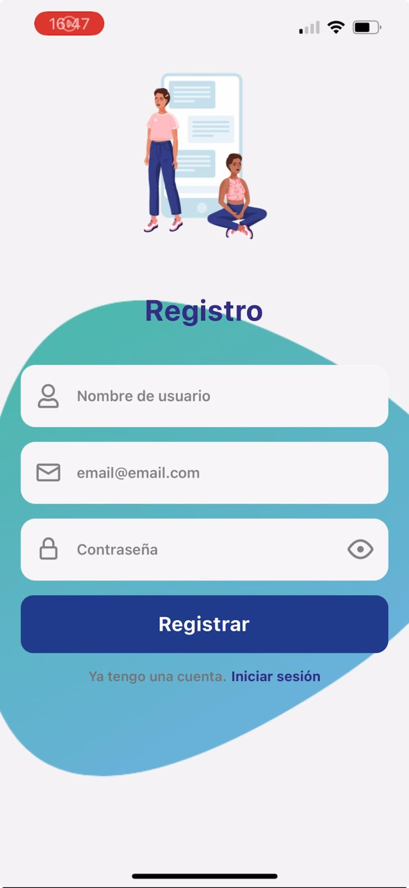
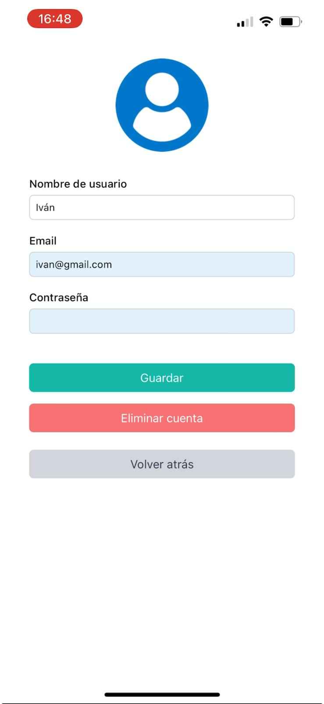
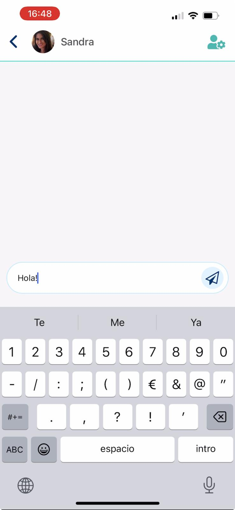

# Whisper

Whisper es una aplicación de mensajería en tiempo real desarrollada con **React Native**, **TypeScript**, **Tailwind CSS** y **Firebase**, diseñada para ofrecer una experiencia de mensajería segura, rápida y sencilla en plataformas móviles.

## Características Principales 🚀

- **Autenticación de Usuarios**: Gestión segura de usuarios utilizando Firebase Authentication.
- **Mensajería en Tiempo Real**: Chats instantáneos con soporte para múltiples conversaciones.
- **Actualización de Perfiles**: Los usuarios pueden actualizar su imagen de perfil y nombre de usuario.
- **Subida de Imágenes**: Los usuarios pueden seleccionar y subir fotos de perfil directamente desde su dispositivo.
- **Diseño Responsivo**: Una interfaz limpia y adaptativa creada con Tailwind CSS.
- **Eliminación de Cuenta**: Los usuarios pueden eliminar permanentemente sus cuentas.

## Tecnologías Utilizadas 🛠️

- **React Native**: Framework para el desarrollo móvil multiplataforma (iOS y Android)
- **TypeScript**: Superconjunto de JavaScript que mejora la calidad y seguridad del código.
- **Tailwind CSS**: Framework de utilidades para estilos rápidos y reutilizables.
- **Firebase**: Backend para autenticación, base de datos en tiempo real, y almacenamiento de archivos.

## Licencia 📄

Este proyecto está bajo la **Licencia MIT** - mira el archivo [LICENSE](LICENSE) para más detalles.

## Contacto ✉️

Si tienes preguntas o sugerencias, no dudes en ponerte en contacto conmigo a través de mi [LinkedIn](https://www.linkedin.com/in/sandra-rodriguez-reyes)
